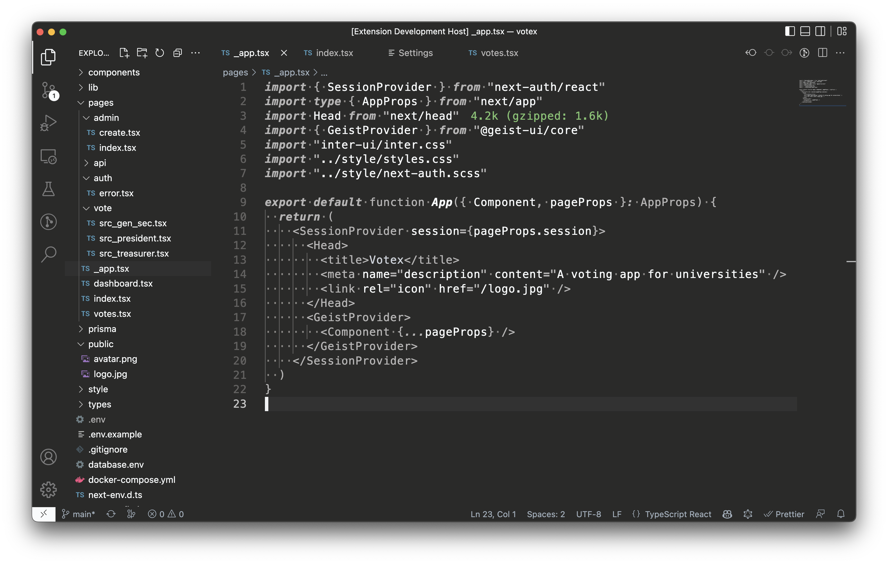

<div align="center">

# Minimal Theme
A Nothing Inspired Minimal VSCode Theme




</div>

# Installation

1. Open the **Extensions** sidebar in VS Code. `View → Extensions`
1. Search for `Minimal`, choose "Minimal Theme" by **Ephraim Atta-Duncan**
1. Click **Install** to install it
1. Navigate to File > Preferences > Color Theme > **Minimal**

## Recommended Settings

```json
{
    // Bracket-pair colorization
    "editor.bracketPairColorization.enabled": false,
}
```

## Contributing

See something strange? Please report [here](https://github.com/dephraiim/vscode-minimal/issues). A screenshot would be great for clarification purposes. Also, you might want to check out the [contributing guide](https://github.com/dephraiim/vscode-minimal/blob/master/contributing.md).

## License

This theme is released under the [MIT License](./LICENSE).

<!--
✨ Designed by **[Ephraim Atta-Duncan](https://astrosaurus.me?utm_source=minimal)** in **[Takoradi, Ghana](https://www.google.com/maps/place/Takoradi)**. Find me on **[Twitter](https://twitter.com/dephraiim)** ✨ -->